# Product Requirements Document (PRD)
## Super Multi-Agent AWS MCP Server

**Version**: 1.0  
**Date**: January 2025  
**Author**: Manish Taneja 
**Status**: Draft  

---

## 1. Executive Summary

### Problem Statement
Managing AWS environments is complex and fragmented. Organizations struggle with:
- **Fragmented workflows**: Provisioning infrastructure, configuring workloads, operational tasks, cost monitoring, compliance, and ML services are handled by different teams and tools
- **Slow execution**: Manual processes and tool switching create bottlenecks
- **Risk exposure**: Prone to configuration drift, misconfigurations, and cost overruns
- **Lack of auditability**: No unified view of changes and their impact
- **Skill barriers**: Teams need expertise across multiple tools and technologies

### Solution Overview
Build a **Super Multi-Agent MCP Server** that enables teams to manage **all AWS services** through **natural language commands**. The system uses AI to intelligently route requests to appropriate subsystems (Terraform, Ansible, CLI, Cost, Security, Monitoring, ML) while ensuring **safety, auditability, and multi-tenancy**.

### Key Value Propositions
- **Unified Interface**: Single natural language interface for all AWS operations
- **Intelligent Routing**: AI automatically selects the right tool for each task
- **Enterprise Security**: Multi-tenant, audit-first design with comprehensive guardrails
- **Operational Excellence**: Automated workflows with approval gates and cost controls
- **Knowledge Reuse**: Learn from past operations and suggest optimizations

---

## 2. Product Goals & Objectives

### Primary Goals

#### 2.1 Multi-Agent Orchestration
- **Dedicated Specialized Agents**: Separate agents for infrastructure, configuration, operations, cost, security, monitoring, and ML
- **Intelligent Coordination**: Agents can work independently or collaborate on complex workflows
- **Tool Integration**: Seamless integration with Terraform, Ansible, AWS CLI, and specialized AWS services

#### 2.2 Natural Language Interface
- **Conversational Commands**: Users express intent in natural language (e.g., "Create 3 EC2 instances with NGINX")
- **Context Understanding**: System understands context, constraints, and requirements from natural language
- **Multi-step Workflows**: Support for complex, multi-step operations through conversation

#### 2.3 Multi-Tenant Architecture
- **Tenant Isolation**: Complete isolation between different organizations/teams
- **Account Management**: Support for multiple AWS accounts per tenant with role-based access
- **Configurable Policies**: Tenant-specific policies, budgets, and constraints

#### 2.4 Audit-First Design
- **Complete Traceability**: Every command tracked from intent to execution
- **Immutable Audit Trail**: All operations stored with metadata, approvals, and outcomes
- **Compliance Ready**: Built-in compliance reporting and audit capabilities

#### 2.5 Knowledge Reuse
- **Artifact Library**: Reusable Terraform modules, Ansible playbooks, and operational scripts
- **Smart Suggestions**: AI suggests similar past operations and optimizations
- **Template Management**: Curated templates for common use cases

#### 2.6 Enterprise Security
- **Multi-layered Security**: Policy, budget, and security guardrails at every level
- **Approval Workflows**: Configurable approval processes for different operation types
- **Risk Mitigation**: Proactive risk assessment and mitigation strategies

---

## 3. System Architecture

### 3.1 High-Level Architecture

The system follows a microservices architecture with clear separation of concerns, built on AWS-native services for scalability and reliability.

### 3.2 Core Components

#### 3.2.1 MCP Server (FastAPI + LangGraph)
- **Purpose**: Central orchestration hub that normalizes natural language input and routes to appropriate agents
- **Technology**: FastAPI for REST APIs, LangGraph for AI workflow orchestration
- **Capabilities**:
  - Natural language processing and intent classification
  - Agent coordination and workflow management
  - Tool exposure for Terraform, Ansible, CLI, Cost, Security, Monitoring, ML
  - Multi-tenant request routing and isolation

#### 3.2.2 Specialized Agents

| Agent | Purpose | Technology | Key Capabilities |
|-------|---------|------------|------------------|
| **Infra Agent** | Infrastructure provisioning | Terraform | Provision/update infrastructure, state management |
| **Config Agent** | Configuration management | Ansible | Package installation, patching, service configuration |
| **Ops Agent** | Operational tasks | AWS CLI/SSM | Instance management, secrets rotation, maintenance |
| **Cost Agent** | Cost management | Cost Explorer, Infracost | Cost analysis, budgeting, optimization recommendations |
| **Security Agent** | Security operations | GuardDuty, Security Hub | Threat detection, compliance scanning, IAM management |
| **Monitoring Agent** | Observability | CloudWatch, X-Ray | Log analysis, metrics collection, performance monitoring |
| **ML Agent** | Machine learning | Bedrock, SageMaker | ML model deployment, data analysis, AI services |

#### 3.2.3 Intelligent Classifier
- **Purpose**: Routes natural language queries to the correct agent or combination of agents
- **Capabilities**:
  - Intent recognition and classification
  - Multi-agent workflow coordination
  - Context-aware routing decisions
  - Support for hybrid flows (e.g., Terraform + Ansible sequences)

#### 3.2.4 Audit & Artifact Registry
- **Storage**: DynamoDB for metadata, S3 for artifacts
- **Artifacts Stored**:
  - Terraform code and state files
  - Ansible playbooks and inventories
  - CLI command logs and outputs
  - Cost reports and security findings
  - Monitoring dashboards and alerts
- **Metadata Includes**:
  - Purpose and intent classification
  - Input parameters and constraints
  - Approval workflow status
  - Execution outputs and results
  - Cost and security impact analysis

#### 3.2.5 Multi-Tenant Configuration Management
- **Per-Tenant Settings**:
  - AWS account configurations (role ARN, regions, VPC preferences)
  - Budget limits and cost controls
  - Policy constraints and compliance requirements
  - Approval workflows and user permissions
- **Configuration Selection**: Users select active configuration at login

---

### 3.3 Architecture Diagram

```mermaid
graph TB
    User[👤 User] --> NL[Natural Language Input]
    NL --> MCP[MCP Server<br/>FastAPI + LangGraph]
    
    MCP --> Classifier[Intelligent Classifier]
    Classifier --> AgentPool[Agent Pool]
    
    AgentPool --> InfraAgent[🏗️ Infra Agent<br/>Terraform]
    AgentPool --> ConfigAgent[⚙️ Config Agent<br/>Ansible]
    AgentPool --> OpsAgent[🔧 Ops Agent<br/>CLI/SSM]
    AgentPool --> CostAgent[💰 Cost Agent<br/>Cost Explorer]
    AgentPool --> SecurityAgent[🔒 Security Agent<br/>GuardDuty]
    AgentPool --> MonitorAgent[📊 Monitoring Agent<br/>CloudWatch]
    AgentPool --> MLAgent[🤖 ML Agent<br/>Bedrock/SageMaker]
    
    InfraAgent --> Execution[Execution Runners<br/>ECS Fargate]
    ConfigAgent --> Execution
    OpsAgent --> Execution
    CostAgent --> Execution
    SecurityAgent --> Execution
    MonitorAgent --> Execution
    MLAgent --> Execution
    
    Execution --> Audit[Audit & Artifact Store<br/>DynamoDB + S3]
    Audit --> Frontend[Frontend GUI<br/>Next.js]
    
    Frontend --> User
    
    subgraph "Multi-Tenant Config"
        TenantConfig[Tenant Configs<br/>Accounts, Roles, Policies]
    end
    
    MCP --> TenantConfig
```

### 3.4 Data Flow

1. **Input Processing**: User submits natural language command
2. **Intent Classification**: MCP Server processes and classifies intent
3. **Agent Selection**: Intelligent classifier routes to appropriate agent(s)
4. **Execution**: Selected agent(s) execute the requested operation
5. **Audit Storage**: All operations and artifacts are stored for audit
6. **Response**: Results are returned to user through frontend interface

---

## 4. Core User Flows

### 4.1 Infrastructure Provisioning Flow

#### Example: "Create 3 t3.medium instances in ap-south-1 with ALB"

**Step 1: Intent Processing**
- User submits natural language request
- MCP Server classifies intent as infrastructure provisioning
- System extracts parameters: instance type, count, region, load balancer

**Step 2: Terraform Generation**
- Infra Agent generates Terraform configuration
- Creates VPC, subnets, security groups, ALB, and EC2 instances
- Validates against tenant policies and constraints

**Step 3: Plan & Approval**
- System runs `terraform plan` and generates cost estimate
- Plan is reviewed by designated approvers
- Approval workflow includes policy compliance check

**Step 4: Execution**
- Upon approval, `terraform apply` is executed
- Real-time progress updates provided to user
- State is locked during execution to prevent conflicts

**Step 5: Audit & Storage**
- Terraform code, plan, and apply logs stored in S3
- Metadata recorded in DynamoDB
- Cost impact and resource inventory updated

### 4.2 Configuration Management Flow

#### Example: "Install NGINX and enable SSL on dev servers"

**Step 1: Target Identification**
- Config Agent identifies target servers based on tags/environment
- Creates or updates Ansible inventory

**Step 2: Playbook Generation**
- Generates Ansible playbook for NGINX installation and SSL configuration
- Includes SSL certificate management and security hardening

**Step 3: Dry Run & Validation**
- Executes `ansible-playbook --check` for validation
- Reviews changes and potential impact
- Validates against security policies

**Step 4: Execution**
- Upon approval, executes playbook on target servers
- Provides real-time execution logs and status updates
- Handles rollback in case of failures

**Step 5: Verification**
- Verifies successful installation and configuration
- Updates monitoring and inventory systems
- Stores playbook and execution logs for audit

### 4.3 Operational Commands Flow

#### Example: "Restart EC2 instances tagged Env=staging"

**Step 1: Resource Discovery**
- Ops Agent queries AWS for instances matching criteria
- Validates user permissions for target resources
- Estimates impact and downtime

**Step 2: Safety Checks**
- Verifies instances are not in critical production workloads
- Checks for active user sessions or running processes
- Validates maintenance window compliance

**Step 3: Execution Planning**
- Creates execution plan with rollback strategy
- Schedules execution if maintenance window required
- Notifies relevant stakeholders

**Step 4: Command Execution**
- Executes restart commands via AWS CLI or SSM
- Monitors execution status and health checks
- Provides real-time updates to user

**Step 5: Post-Execution**
- Verifies successful restart and service availability
- Updates monitoring dashboards
- Records execution details for audit trail

### 4.4 Cost Management Flow

#### Example: "What is my daily EC2 spend in ap-south-1?"

**Step 1: Query Processing**
- Cost Agent parses cost analysis request
- Identifies time range, services, and regions

**Step 2: Data Collection**
- Queries AWS Cost Explorer API
- Aggregates cost data by service, instance type, and usage
- Applies tenant-specific cost allocation tags

**Step 3: Analysis & Visualization**
- Generates cost breakdown and trends
- Creates visual charts and reports
- Identifies cost optimization opportunities

**Step 4: Reporting**
- Returns structured cost data and visualizations
- Stores report in S3 for future reference
- Updates cost tracking dashboards

### 4.5 Security Operations Flow

#### Example: "Scan all S3 buckets for public access"

**Step 1: Resource Discovery**
- Security Agent discovers all S3 buckets in tenant accounts
- Identifies buckets with potential public access

**Step 2: Security Scanning**
- Runs Security Hub findings and custom OPA policies
- Checks bucket policies, ACLs, and public access settings
- Scans for sensitive data exposure

**Step 3: Risk Assessment**
- Analyzes findings and assigns risk scores
- Identifies compliance violations
- Prioritizes remediation actions

**Step 4: Reporting & Remediation**
- Generates security report with findings and recommendations
- Creates remediation playbooks for identified issues
- Updates security dashboard and compliance status

### 4.6 Monitoring & Observability Flow

#### Example: "Show last 24h error logs from Lambda my-func"

**Step 1: Log Query Processing**
- Monitoring Agent parses log query request
- Identifies target Lambda function and time range

**Step 2: Log Retrieval**
- Queries CloudWatch Logs for specified function
- Filters logs by error level and time range
- Aggregates and analyzes log patterns

**Step 3: Analysis & Insights**
- Identifies error patterns and root causes
- Correlates with metrics and traces
- Generates insights and recommendations

**Step 4: Visualization & Alerting**
- Creates log analysis dashboard
- Sets up alerts for similar future errors
- Stores analysis results for audit

### 4.7 Machine Learning Operations Flow

#### Example: "Analyze sentiment of recent customer feedback in S3 bucket"

**Step 1: Data Preparation**
- ML Agent identifies and accesses S3 bucket
- Validates data format and accessibility
- Prepares data for sentiment analysis

**Step 2: Model Selection & Execution**
- Selects appropriate AWS Comprehend model
- Configures analysis parameters and thresholds
- Executes sentiment analysis job

**Step 3: Results Processing**
- Processes analysis results and generates insights
- Creates visualizations and summary reports
- Identifies trends and patterns

**Step 4: Output & Storage**
- Returns sentiment analysis results to user
- Stores results and model artifacts in S3
- Updates ML operations dashboard

---

## 5. Audit & Compliance Model

### 5.1 Audit-First Architecture

Every operation in the system is designed with auditability as a core principle. All user interactions, system decisions, and execution results are captured and stored for compliance, troubleshooting, and optimization purposes.

### 5.2 Audit Data Model

#### 5.2.1 Core Audit Fields

| Field | Type | Description |
|-------|------|-------------|
| `requestId` | UUID | Unique identifier for each request |
| `tenantId` | String | Tenant/organization identifier |
| `userId` | String | User who initiated the request |
| `timestamp` | ISO 8601 | Request initiation time |
| `intent` | JSON | Normalized intent classification |
| `agentType` | String | Agent that processed the request |
| `status` | Enum | Request status (pending, approved, executing, completed, failed) |
| `approvalMetadata` | JSON | Approval workflow details |
| `executionLogs` | S3 URI | Links to execution logs and outputs |
| `costImpact` | Number | Estimated or actual cost impact |
| `securityGates` | JSON | Security policy compliance results |
| `artifacts` | Array | Generated artifacts (Terraform, Ansible, etc.) |

#### 5.2.2 Artifact Storage

**DynamoDB Tables:**
- `audit_runs` - Main audit trail
- `artifacts` - Artifact metadata and references
- `approvals` - Approval workflow tracking
- `cost_tracking` - Cost impact analysis

**S3 Buckets:**
- `audit-logs` - Execution logs and outputs
- `artifacts` - Generated code and configurations
- `reports` - Cost, security, and compliance reports

### 5.3 Compliance Features

#### 5.3.1 Immutable Audit Trail
- All audit records are immutable once created
- Cryptographic signatures for integrity verification
- Retention policies based on compliance requirements

#### 5.3.2 Real-time Monitoring
- Live audit dashboard for security teams
- Automated alerts for policy violations
- Integration with SIEM systems

#### 5.3.3 Compliance Reporting
- Automated compliance reports (SOC2, ISO27001, etc.)
- Custom report generation for specific requirements
- Export capabilities for external audit tools

### 5.4 Audit UI Features

#### 5.4.1 Search & Filtering
- Search by user, date range, agent type, status
- Advanced filters for compliance queries
- Saved search queries for common audits

#### 5.4.2 Audit Dashboard
- Real-time audit metrics and trends
- Policy compliance status
- Cost impact analysis
- Security incident tracking

#### 5.4.3 Artifact Management
- Download generated artifacts
- Compare different versions
- Track artifact usage and modifications

---

## 6. API Specification

### 6.1 Authentication APIs

| Endpoint | Method | Description | Request Body | Response |
|----------|--------|-------------|--------------|----------|
| `/auth/register` | POST | User registration | `{email, password, tenantId}` | `{userId, token}` |
| `/auth/login` | POST | User authentication | `{email, password, mfaCode}` | `{token, userInfo}` |
| `/auth/refresh` | POST | Token refresh | `{refreshToken}` | `{token}` |
| `/auth/logout` | POST | User logout | `{token}` | `{success}` |

### 6.2 Configuration Management APIs

| Endpoint | Method | Description | Request Body | Response |
|----------|--------|-------------|--------------|----------|
| `/configs` | GET | List tenant configurations | Query params | `{configs[]}` |
| `/configs` | POST | Create new configuration | `{name, roleArn, region, tags}` | `{configId}` |
| `/configs/{id}` | GET | Get configuration details | - | `{config}` |
| `/configs/{id}` | PUT | Update configuration | `{name, roleArn, region, tags}` | `{success}` |
| `/configs/{id}` | DELETE | Delete configuration | - | `{success}` |
| `/configs/select` | POST | Select active configuration | `{configId}` | `{success}` |

### 6.3 Natural Language Processing APIs

| Endpoint | Method | Description | Request Body | Response |
|----------|--------|-------------|--------------|----------|
| `/nl/intent` | POST | Process natural language input | `{query, context}` | `{intent, confidence, agentType}` |
| `/nl/classify` | POST | Classify intent type | `{query}` | `{intentType, parameters}` |

### 6.4 Infrastructure Management APIs

| Endpoint | Method | Description | Request Body | Response |
|----------|--------|-------------|--------------|----------|
| `/infra/generate` | POST | Generate Terraform code | `{intent, configId}` | `{artifactId, branchName}` |
| `/infra/plan` | POST | Create Terraform plan | `{artifactId}` | `{runId, planUri}` |
| `/infra/apply` | POST | Apply Terraform changes | `{runId, approvalToken}` | `{runId, status}` |
| `/infra/status` | GET | Get execution status | `{runId}` | `{status, logs, outputs}` |

### 6.5 Configuration Management APIs

| Endpoint | Method | Description | Request Body | Response |
|----------|--------|-------------|--------------|----------|
| `/config/generate` | POST | Generate Ansible playbook | `{intent, targets}` | `{playbookId}` |
| `/config/dryrun` | POST | Dry run Ansible playbook | `{playbookId}` | `{runId, changes}` |
| `/config/apply` | POST | Apply Ansible playbook | `{playbookId, approvalToken}` | `{runId, status}` |
| `/config/status` | GET | Get playbook execution status | `{runId}` | `{status, logs, results}` |

### 6.6 Operations APIs

| Endpoint | Method | Description | Request Body | Response |
|----------|--------|-------------|--------------|----------|
| `/ops/run` | POST | Execute operational command | `{command, targets, context}` | `{runId, status}` |
| `/ops/status` | GET | Get command execution status | `{runId}` | `{status, output, logs}` |
| `/ops/cancel` | POST | Cancel running operation | `{runId}` | `{success}` |

### 6.7 Cost Management APIs

| Endpoint | Method | Description | Request Body | Response |
|----------|--------|-------------|--------------|----------|
| `/cost/query` | POST | Query cost data | `{timeRange, services, filters}` | `{costData, charts}` |
| `/cost/estimate` | POST | Estimate cost impact | `{changes, timeRange}` | `{estimate, breakdown}` |
| `/cost/budgets` | GET | Get budget information | Query params | `{budgets, alerts}` |
| `/cost/optimize` | POST | Get optimization recommendations | `{services, constraints}` | `{recommendations[]}` |

### 6.8 Security APIs

| Endpoint | Method | Description | Request Body | Response |
|----------|--------|-------------|--------------|----------|
| `/security/scan` | POST | Run security scan | `{targets, scanType}` | `{scanId, status}` |
| `/security/findings` | GET | Get security findings | Query params | `{findings[], summary}` |
| `/security/remediate` | POST | Remediate security issues | `{findingIds, action}` | `{remediationId}` |
| `/security/policies` | GET | Get security policies | Query params | `{policies[]}` |

### 6.9 Monitoring APIs

| Endpoint | Method | Description | Request Body | Response |
|----------|--------|-------------|--------------|----------|
| `/monitor/logs` | POST | Query log data | `{query, timeRange, filters}` | `{logs[], summary}` |
| `/monitor/metrics` | POST | Query metrics data | `{metrics, timeRange, filters}` | `{data, charts}` |
| `/monitor/alerts` | GET | Get active alerts | Query params | `{alerts[]}` |
| `/monitor/dashboards` | GET | Get dashboard data | Query params | `{dashboards[]}` |

### 6.10 Machine Learning APIs

| Endpoint | Method | Description | Request Body | Response |
|----------|--------|-------------|--------------|----------|
| `/ml/run` | POST | Execute ML operation | `{operation, parameters, data}` | `{jobId, status}` |
| `/ml/status` | GET | Get ML job status | `{jobId}` | `{status, progress, results}` |
| `/ml/models` | GET | List available models | Query params | `{models[]}` |
| `/ml/predict` | POST | Make prediction | `{modelId, input}` | `{prediction, confidence}` |

### 6.11 Audit & Artifacts APIs

| Endpoint | Method | Description | Request Body | Response |
|----------|--------|-------------|--------------|----------|
| `/audit` | GET | List audit records | Query params | `{records[], pagination}` |
| `/audit/{id}` | GET | Get audit record details | - | `{record, artifacts}` |
| `/artifacts/{id}` | GET | Get artifact details | - | `{artifact, downloadUrl}` |
| `/artifacts/{id}/download` | GET | Download artifact | - | File download |
| `/audit/export` | POST | Export audit data | `{filters, format}` | `{exportId, downloadUrl}` |

---

## 7. Frontend Application (Next.js)

### 7.1 Application Architecture

The frontend is built using Next.js 14 with App Router, providing a modern, responsive interface for all system operations.

### 7.2 Core Pages & Features

#### 7.2.1 Authentication Pages
- **Login Page** (`/login`)
  - Email/password authentication
  - MFA support (TOTP/SMS)
  - Tenant selection dropdown
  - "Remember me" functionality

- **Registration Page** (`/register`)
  - User registration with email verification
  - Tenant creation or invitation code entry
  - Initial configuration setup

#### 7.2.2 Main Application Pages

**Console Tab** (`/console`)
- Natural language input interface
- Real-time intent classification display
- Execution status and progress tracking
- Quick action buttons for common operations

**Audit Tab** (`/audit`)
- Comprehensive audit trail viewer
- Advanced filtering and search capabilities
- Artifact download and comparison
- Compliance reporting tools

**Config Tab** (`/config`)
- AWS account configuration management
- Role and permission management
- Budget and policy configuration
- Environment-specific settings

**Reports Tab** (`/reports`)
- Cost analysis dashboards
- Security findings and compliance status
- Monitoring charts and alerts
- Performance metrics and trends

### 7.3 Key Components

#### 7.3.1 Natural Language Console
- **Smart Input**: Auto-complete and suggestion engine
- **Intent Preview**: Real-time intent classification display
- **Context Awareness**: Maintains conversation context
- **Multi-step Workflows**: Support for complex operations

#### 7.3.2 Audit Dashboard
- **Timeline View**: Chronological audit trail
- **Filter Panel**: Advanced filtering options
- **Artifact Viewer**: Code and configuration preview
- **Export Tools**: Data export in multiple formats

#### 7.3.3 Configuration Manager
- **Account Selector**: Multi-account management
- **Policy Editor**: Visual policy configuration
- **Budget Tracker**: Real-time cost monitoring
- **Approval Workflows**: Configurable approval processes

---

## 8. Security & Guardrails

### 8.1 Multi-Layered Security Architecture

#### 8.1.1 Service Control Policies (SCPs)
- **Global Restrictions**: Deny dangerous actions across all accounts
- **IAM Protection**: Prevent `iam:*` operations except for pipeline roles
- **Resource Controls**: Enforce encryption, tagging, and naming conventions
- **Region Restrictions**: Limit operations to approved regions

#### 8.1.2 Policy as Code
- **OPA/Regula Policies**: Comprehensive policy validation
- **Terraform Policies**: Infrastructure-specific constraints
- **Ansible Policies**: Configuration management rules
- **CLI Policies**: Operational command restrictions

#### 8.1.3 Budget Controls
- **Hard Stops**: Automatic failure if cost thresholds exceeded
- **Infracost Integration**: Real-time cost estimation and validation
- **Budget Alerts**: Proactive cost monitoring and notifications
- **Cost Attribution**: Detailed cost tracking per tenant/project

### 8.2 Approval & Workflow Controls

#### 8.2.1 Approval Gates
- **Mandatory Approvals**: Required for all infrastructure changes
- **Role-based Approvals**: Different approval levels based on impact
- **Time-based Approvals**: Emergency approval processes
- **Documentation Requirements**: Mandatory change documentation

#### 8.2.2 Execution Isolation
- **Tenant Isolation**: Complete separation between tenants
- **Docker Containers**: Isolated execution environments
- **ECS Fargate**: Serverless container execution
- **Network Isolation**: VPC-based network segmentation

### 8.3 Secrets Management
- **AWS Secrets Manager**: Centralized secret storage
- **Encryption at Rest**: All secrets encrypted with KMS
- **Rotation Policies**: Automated secret rotation
- **Access Logging**: Complete audit trail for secret access

---

## 9. Non-Functional Requirements

### 9.1 Security Requirements
- **Multi-Factor Authentication**: MFA required for all users
- **Least Privilege IAM**: Minimal required permissions
- **Encrypted Storage**: All data encrypted at rest and in transit
- **Network Security**: VPC isolation and security groups
- **Compliance**: SOC2, ISO27001, and industry-specific compliance

### 9.2 Reliability Requirements
- **High Availability**: 99.9% uptime SLA
- **State Locking**: Terraform state protection
- **Retry Logic**: Automatic retry for transient failures
- **Drift Detection**: Automated configuration drift monitoring
- **Backup & Recovery**: Automated backup and disaster recovery

### 9.3 Performance Requirements
- **Response Times**:
  - P95 plan pipeline < 10 minutes
  - CLI operations < 30 seconds
  - API responses < 2 seconds
  - UI interactions < 500ms
- **Throughput**: Support 1000+ concurrent users
- **Scalability**: Auto-scaling based on demand

### 9.4 Scalability Requirements
- **Multi-Tenant**: Support 100+ tenants
- **Auto-scaling**: ECS runners scale based on workload
- **Storage**: Unlimited artifact storage in S3
- **Database**: DynamoDB auto-scaling for metadata

### 9.5 Compliance Requirements
- **Audit Immutability**: Immutable audit logs
- **CloudTrail Integration**: Complete AWS API logging
- **Data Retention**: Configurable retention policies
- **Export Capabilities**: Compliance report generation

---

## 10. Implementation Deliverables

### 10.1 Core Platform Components

#### 10.1.1 MCP Server
- **FastAPI Application**: RESTful API server
- **LangGraph Integration**: AI workflow orchestration
- **Multi-Agent Framework**: Specialized agent implementations
- **Authentication & Authorization**: JWT-based security

#### 10.1.2 Agent Implementations
- **Infrastructure Agent**: Terraform automation
- **Configuration Agent**: Ansible playbook management
- **Operations Agent**: AWS CLI and SSM integration
- **Cost Agent**: Cost analysis and optimization
- **Security Agent**: Security scanning and compliance
- **Monitoring Agent**: Observability and alerting
- **ML Agent**: Machine learning operations

### 10.2 Data & Storage Layer
- **DynamoDB Schema**: Audit, artifacts, and configuration tables
- **S3 Buckets**: Artifact storage and log aggregation
- **Terraform Backend**: S3 state storage with DynamoDB locking
- **CloudWatch**: Logging and monitoring infrastructure

### 10.3 Frontend Application
- **Next.js Application**: Modern React-based frontend
- **Component Library**: Reusable UI components
- **State Management**: Redux/Zustand for application state
- **Responsive Design**: Mobile and desktop optimized

### 10.4 CI/CD & Automation
- **GitHub Actions**: Automated testing and deployment
- **Terraform Modules**: Reusable infrastructure components
- **Policy Bundles**: OPA, Checkov, Regula, Infracost policies
- **Deployment Scripts**: Automated deployment and rollback

### 10.5 AWS Infrastructure
- **ECS Fargate**: Serverless container execution
- **Cognito**: User authentication and management
- **VPC**: Network isolation and security
- **CloudFront**: CDN for frontend delivery
- **Route 53**: DNS management and health checks

---

## 11. Success Metrics & KPIs

### 11.1 Technical Metrics
- **System Uptime**: 99.9% availability
- **Response Times**: Meet all performance requirements
- **Error Rates**: < 0.1% error rate
- **Security Incidents**: Zero security breaches

### 11.2 Business Metrics
- **User Adoption**: 80% of target users actively using system
- **Cost Savings**: 30% reduction in infrastructure management time
- **Compliance**: 100% audit compliance
- **User Satisfaction**: 4.5+ rating on user surveys

### 11.3 Operational Metrics
- **Deployment Frequency**: Daily deployments
- **Mean Time to Recovery**: < 30 minutes
- **Change Failure Rate**: < 5%
- **Lead Time**: < 2 hours for standard changes

---

## 12. Risk Assessment & Mitigation

### 12.1 Technical Risks
- **AI Model Accuracy**: Mitigation through continuous training and validation
- **Scalability Limits**: Mitigation through auto-scaling and performance testing
- **Security Vulnerabilities**: Mitigation through regular security audits
- **Data Loss**: Mitigation through comprehensive backup strategies

### 12.2 Business Risks
- **User Adoption**: Mitigation through training and change management
- **Compliance Issues**: Mitigation through built-in compliance features
- **Cost Overruns**: Mitigation through budget controls and monitoring
- **Vendor Lock-in**: Mitigation through open-source components

---

*This PRD serves as the comprehensive blueprint for building the Super Multi-Agent AWS MCP Server, providing a unified, intelligent, and secure platform for managing all aspects of AWS infrastructure and operations.*
